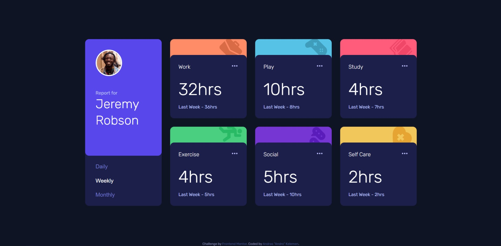

# Frontend Mentor - Time tracking dashboard solution

This is a solution to the [Time tracking dashboard challenge on Frontend Mentor](https://www.frontendmentor.io/challenges/time-tracking-dashboard-UIQ7167Jw). Frontend Mentor challenges help you improve your coding skills by building realistic projects. 

## Table of contents

- [Overview](#overview)
  - [The challenge](#the-challenge)
  - [Screenshot](#screenshot)
  - [Links](#links)
- [My process](#my-process)
  - [Built with](#built-with)
  - [What I learned](#what-i-learned)
  - [Useful resources](#useful-resources)

## Overview

### The challenge

Users should be able to:

- View the optimal layout for the site depending on their device's screen size
- See hover states for all interactive elements on the page
- Switch between viewing Daily, Weekly, and Monthly stats

### Screenshot

### Links

- Solution URL: [GitHub](https://github.com/androgitai/TimeTrackingDashboard)
- Live Site URL: [Netlify](https://time-dashboard.netlify.app/)

## My process

- First I layed out the HTML and worked out class names and general file structure. After that I refactored a couple of times to make it more concise.
- Added the JS functionality and where needed I did a bit more refactor in all the code to make ther JS part easier.

### Built with

- Semantic HTML5 markup
- Sass
- Flexbox
- CSS Grid
- Javascript
- Desktop-first workflow

### What I learned

I learned a lot about positioning and what makes it a lot easier to do it. Once I got the hang of the main concepts with some tries & fails eventually it worked. 
Sass makes it very easy to structure you code.

### Useful resources

- [MDN](https://developer.mozilla.org/) - This is an amazing website which helped me understand a lot about CSS & Javascript.
